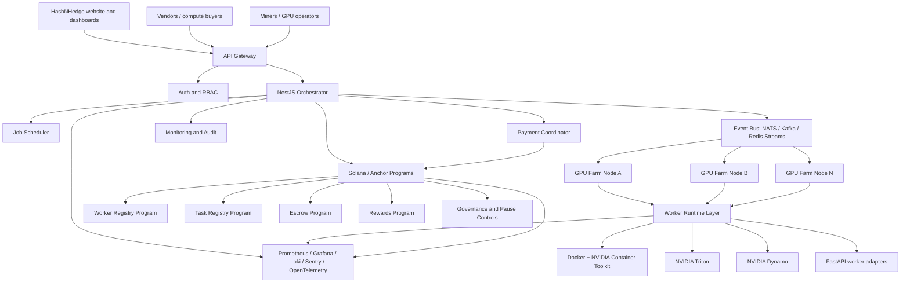
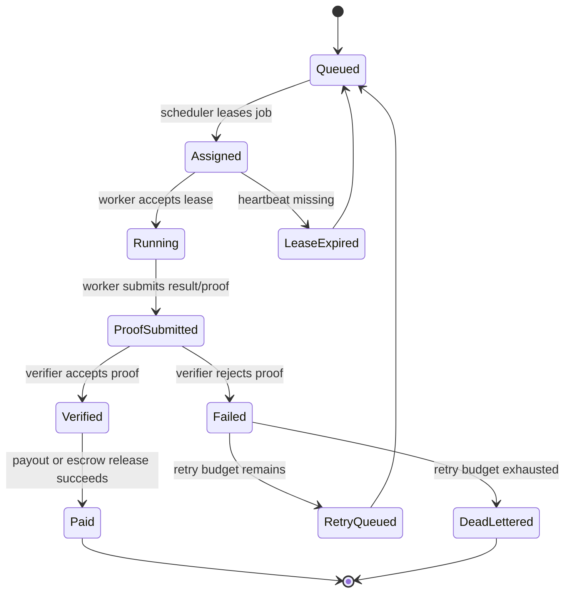

# HashNHedge Target Production Architecture

## Purpose

This document defines the target architecture for the future HashNHedge platform:

- GPU farms and independent workers contribute compute.
- A NestJS control plane coordinates workers, vendors, jobs, payments, and Solana interactions.
- FastAPI worker services handle GPU/AI-adjacent runtime tasks.
- Anchor-based Solana programs manage trust-critical registries, escrow, proofs, rewards, governance, and emergency controls.
- Observability and security controls wrap the full stack.

## High-level architecture

## Control plane responsibilities

The NestJS orchestrator owns the off-chain coordination layer:

- identity, authentication, API keys, and RBAC
- worker registration and heartbeat tracking
- job intake and validation
- job scheduling and leasing
- retry and dead-letter handling
- vendor marketplace flows
- payout coordination
- Solana transaction preparation and indexing
- admin controls and audit logging
- API-level circuit breakers

## Worker runtime responsibilities

Worker runtimes should be containerized and replaceable. Each worker reports its capabilities and accepts leased jobs from the orchestrator.

Initial worker types:

- mining worker
- AI inference worker
- general compute worker
- GPU telemetry sidecar
- Triton gateway worker
- Dynamo gateway worker

## Job lifecycle

## Solana program responsibilities

Anchor programs should only own trust-critical state and settlement workflows:

- worker registry
- task registry
- escrow accounts
- proof submission records
- reward distribution
- admin/multisig governance
- pause/emergency controls

Off-chain systems should not rely on smart contracts for every scheduling action. High-frequency orchestration should remain off-chain, while settlement, proofs, escrow, and public accountability live on-chain.

## Security boundaries

### API boundary

- JWT/session authentication
- scoped API keys for vendors and workers
- request signing for workers
- nonce/timestamp replay protection
- endpoint-specific rate limits
- payload size limits
- centralized validation and sanitization
- audit logging and redaction

### Worker boundary

- jobs run in containers
- GPU access limited to declared device scope
- no untrusted workload gets host-level privileges
- network egress rules by job type
- signed worker releases
- telemetry sidecar reports utilization and health

### Solana boundary

- PDA validation
- signer checks
- checked arithmetic
- multisig admin controls
- pause controls on payout and escrow flows
- event monitoring
- third-party audit before mainnet launch

## Observability requirements

Minimum production dashboards:

- active workers
- worker heartbeat freshness
- GPU utilization
- queued/running/failed jobs
- proof verification success rate
- payout liability
- API error rate
- API p95/p99 latency
- Solana transaction failures
- security events

## Initial build sequence

1. NestJS orchestrator skeleton
2. Worker heartbeat and registry
3. Job lifecycle state machine
4. Worker lease and retry logic
5. Containerized worker template
6. GPU telemetry
7. Anchor program skeleton
8. Escrow/reward proof of concept
9. Observability baseline
10. Security hardening pass
