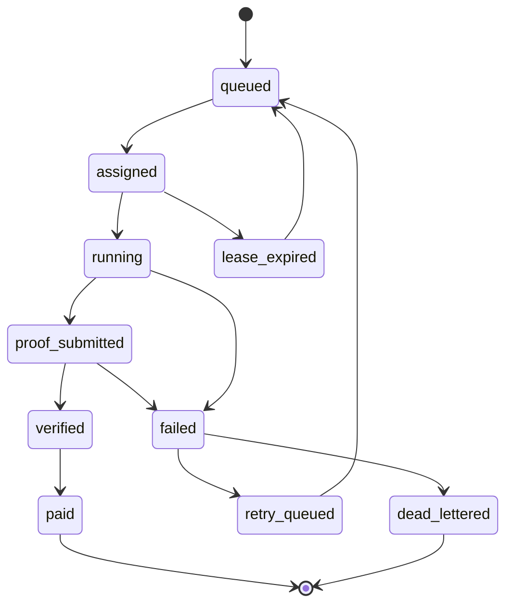

# Job Lifecycle State Machine

HashNHedge jobs must move through explicit states so workers, vendors, payments, and Solana settlement remain consistent.

## States

| State | Meaning |
| --- | --- |
| `queued` | Job accepted and waiting for assignment |
| `assigned` | Scheduler leased the job to a worker |
| `running` | Worker accepted the lease and started work |
| `proof_submitted` | Worker submitted result/proof metadata |
| `verified` | Proof/result passed verification |
| `paid` | Reward or escrow settlement completed |
| `failed` | Job failed and may retry |
| `retry_queued` | Job returned to queue after retryable failure |
| `dead_lettered` | Retry budget exhausted or manual review required |
| `lease_expired` | Worker missed heartbeat or did not accept in time |

## Required metadata

Each job should track:

- `jobId`
- `vendorId` or requester identity
- `jobType`
- `requirements`
- `reward` / budget
- `assignedWorkerId`
- `leaseId`
- `leaseExpiresAt`
- `retryCount`
- `maxRetries`
- `proofHash`
- `resultUri`
- `verificationStatus`
- `payoutStatus`
- `createdAt`, `updatedAt`, `completedAt`

## Transitions

## Guardrails

- A worker can only claim a job with an active lease.
- A lease must expire automatically if the worker heartbeat is stale.
- A job cannot be paid unless it is verified.
- A job cannot be verified unless proof/result metadata exists.
- A worker cannot submit proof for a job assigned to another worker.
- Every state transition must emit an audit event.
